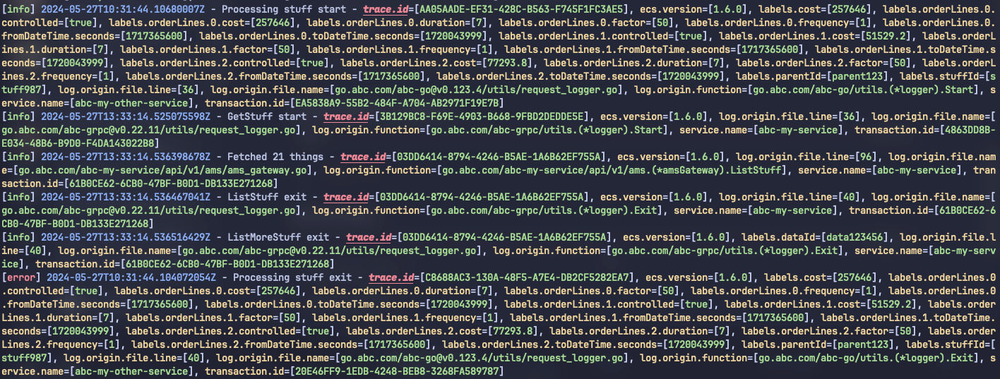
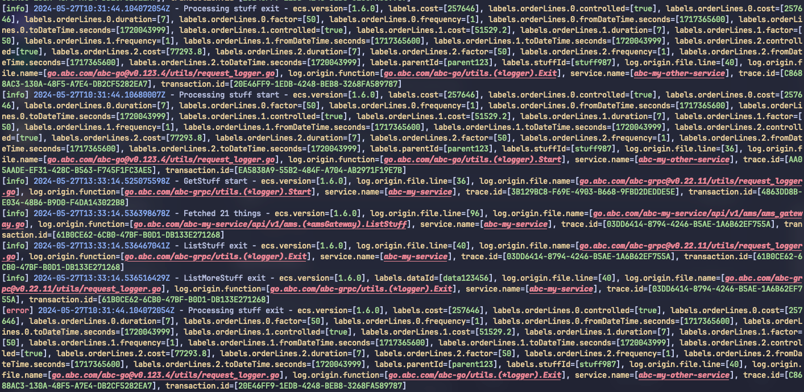

# Pretty Logrus

Takes JSON-formatted [logrus](https://github.com/sirupsen/logrus) log messages as input and prints them back out in a more human readable format.

### Build it

```shell
go build -o plr ./...
```

Put the `plr` executable somewhere on your PATH.

### Usage

```shell
kubectl logs <pod> | plr
```

#### Usage together with [pod-id](https://github.com/eaardal/pod-id)

[Pod-id](https://github.com/eaardal/pod-id) is a small utility to get the pod id from a partial pod name.

It lets you look up pods by a partial name, like this:

```shell
kubectl logs $(podid my-app)
```

This shell alias is useful for combining `podid` and `plr`:

```shell
alias klogs='kubectl logs $(podid $1) | plr'
```

To also be able to pass arguments to `plr`, replace the alias with this function: 

```bash
klogs () {
  local pod_id
  pod_id=$(podid "$1")
  shift
  kubectl logs "$pod_id" | plr "$@"
}

# Usage examples:
klogs my-app # prints the logs from the pod where the name contains "my-app". 
klogs my-app --field trace.id # pretty-logrus arguments work as expected.
```

> Note: The `klogs` function does not forward arguments to pod-id. If you need to pass arguments to pod-id, you can use the full command: `kubectl logs $(podid my-app <args here>) | plr`.

## Options:

- `--multi-line | -M`: Print output on multiple lines with log message and level first and then each data field on separate lines.
- `--no-data`: Don't show any logged data fields.
- `--level <level> | -L`: Only show log messages matching this level. Values (logrus levels): `trace` | `debug` | `info` | `warning` | `error` | `fatal` | `panic`
- `--min-level <level>`: Only show log messages at this log level or higher. Severity levels: `trace=1, debug=2, info=3, warning=4, error=5, fatal=6, panic=7`
- `--max-level <level>`: Only show log messages at this log level or lower. Severity levels: `trace=1, debug=2, info=3, warning=4, error=5, fatal=6, panic=7`
- `--fields <field>(,<field>) | -F`: Only show specific data field(s). Several field names can be separated by comma. Field name can have leading and/or trailing wildcard `*`.
- `--except <field>(,<field>) | -E`: Don't show this particular field or fields separated by comma. Field name can have leading and/or trailing wildcard `*`.
- `--trunc <field>=<num chars or substr>`: Truncate the content of this field by an index or substring.
- `--where <field>=<value> | -W`: Only show log messages where the value occurs.
- `--highlight-key <field> | -K`: Highlight the key of the field in the output. Field name can have leading and/or trailing wildcard `*`. By default, this is displayed in bold red text. Styles can be overridden in the [configuration file](./CONFIG_FILE_SPEC.md).
- `--highlight-value <field value> | -V`: Highlight the value of the field in the output. Field value can have leading and/or trailing wildcard `*`. By default, this is displayed in bold red text. Styles can be overridden in the [configuration file](./CONFIG_FILE_SPEC.md).
- `--all-fields`: Show all data fields regardless of `--except` flag or fields being excluded via `ExcludedFields` in the config file.

### --trunc examples

- `--trunc message=50`: Print the first 50 characters in the message field
- `--trunc message="\n"`: Print everything up until the first line break in the message field
- `--trunc message="\t"`: Print everything up until the first tab character in the message field
- `--trunc message=mytext`: Print everything up until the first occurrence of the phrase 'mytext' in the message field.
- `--trunc message="stop it"`: Print everything up until the first occurrence of the phrase 'stop it' in the message field.
- `--trunc message=" "`: Print everything up until the first empty space in the message field.

### --where examples

- `--where <field>=<value>`: Only show log messages where the specific field has the given value
- `--where <field>=<value>,<field>=<value>`: Specify multiple conditions separated by comma
- `--where <value>`: Only show log messages where the value occurs in any data field or the message field. Value can be a partial phrase or text.

### Wildcard `*`

Several flags support the wildcard `*` in their values to match several things at once:

- `--fields`
- `--except`
- `--highlight-key`
- `--highlight-value`

Usage:

- Leading: `--arg "*foo"` will match phrases ending with "foo" (case sensitive).
- Trailing: `--arg "foo*"` will match phrases starting with "foo" (case sensitive).
- Both: `--arg "*foo*"` will match phrases containing "foo" (case sensitive).

Gotcha 1: You might need to quote the string:

`--arg labels.* ` might give the output `zsh: no matches found: labels.*` whereas
`--arg "labels.*"` will filter on fields beginning with the phrase "labels.".

Gotcha 2: it's case sensitive. For example when searching for values with `--highlight-value` like `--highlight-value "my-service*"`, "my-service" will be matched as-is. 

## Commands

- `default-config`: Prints the default configuration file to stdout
- `init`: Creates a config file at the location `PRETTY_LOGRUS_HOME` is pointing to. It is required to set this environment variable to run this command.

## Configuration file

See the [configuration spec](./CONFIG_FILE_SPEC.md) for how to set up the configuration file.

# Changelog

> :hammer_and_wrench: - Enhancements, improvements  
> :sparkles: - New features, additions  
> :bug: - Bug fixes  
> :boom: - Breaking changes  
> :scissors: - Remove features, deletions

## v1.4.0

:calendar: 2025-04-01

- :sparkles: Added `--min-level` and `--max-level` arguments to specify when you want to show log messages with _at least_ or _at most_ a certain log level severity. The log levels are ordered like this: `trace=1, debug=2, info=3, warning=4, error=5, fatal=6, panic=7`. Use the log level name to specify the argument, like: `--min-level warning`, this would only show log messages with the levels `warning`, `error`, `fatal` and `panic`. 

## v1.3.0

:calendar: 2024-05-28

- :boom: Removed the `--field` flag. Use `--fields` instead. There is no difference in usage, except `--fields` can do more than `--field` could and as such it was redundant having two really similar args. The `-F` shorthand alias has also been moved to `--fields`.
- :hammer_and_wrench: Added default colors for all logrus log levels. The colors can be overridden in the configuration file.
- :hammer_and_wrench: Added `-E` shorthand alias for the `--except` arg.

## v1.2.2

:calendar: 2024-05-26

- :bug: use `path.Join()` when reading config.json to avoid OS-related file path issues.
- :bug: misc refactoring and cleanup.

## v1.2.1

:calendar: 2024-05-26

- :hammer_and_wrench: Add shorthand aliases to some CLI arguments.
- :bug: Fix various style-related bugs.

## v1.2.0

:calendar: 2024-05-24

- :sparkles: Added a configuration file to customize various aspects of the app, like the text styles. See the [configuration file spec](./CONFIG_FILE_SPEC.md) for more information.
- :sparkles: Added `--highlight-key` and `--highlight-value` flags to highlight specific fields or values in the output.


:point_up: Highlighting the key `trace.id` (`--highlight-key trace.id`).


:point_up: Highlighting all values containing `abc` (`--highlight-value "*abc*"`).

## v1.1.6

:calendar: 2024-05-24

- :hammer_and_wrench: Fields are sorted alphabetically.
- :hammer_and_wrench: Include (`--field`, `--fields`) and exclude (`--except`) flags can now take a wildcard `*` to match several fields at once.

## v1.1.5

:calendar: 2024-04-08

:sparkles: Added `--where` flag to filter log messages based on field values. Example: `--where trace.id=1234`. See usage examples above for more variations.

## v1.1.4

:calendar: 2023-03-13

- :hammer_and_wrench: Support tailing like `kubectl logs -f | plr`

## v1.1.3

:calendar: 2022-10-24

- :hammer_and_wrench: A field named `labels` will be treated as a map of other sub-fields and each sub-field under labels will be printed as `labels.<subfield>=[<value>]`. Example:

Before
```
labels=[map[string]struct{ foo: "bar", abc: "def" }]
```

After
```
labels.foo=[bar] labels.abc=[def]
```

## v1.1.2

:calendar: 2022-10-06

- :bug: If a log line cannot be parsed (i.e. if it's not a line with JSON on the expected logrus format), it will be printed as-is instead of being ignored by the error handler.

## v1.1.1

:calendar: 2022-10-04

- :hammer_and_wrench: Truncate flag now supports substrings, newline and tab characters in addition to a character index.

## v1.1.0

:calendar: 2022-10-04

- :sparkles: Added `--trunc` flag to limit the output length of a certain field. The value of the given field name will be cut off at the given character index. Only one field can be truncated at a time. Example: `--trunc service.name=10`.
- :bug: Fixed a bug where long lines would be skipped entirely and the line would be lost without any warning or information.

## v1.0.0

No changelog at this time
