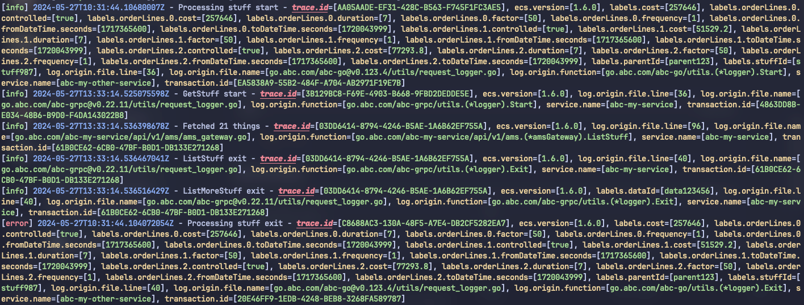
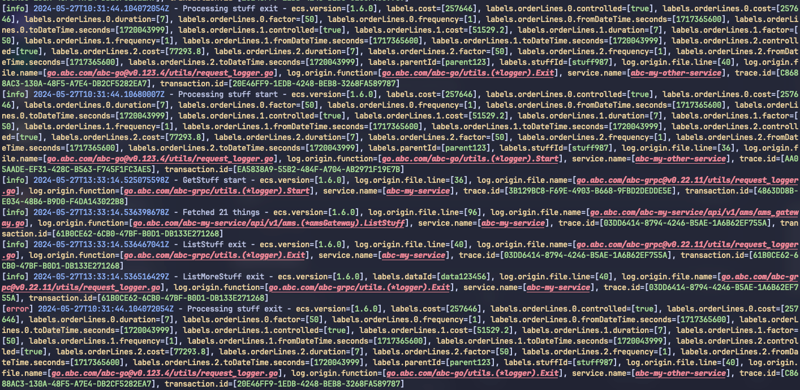

# Pretty Logrus

Takes JSON-formatted [logrus](https://github.com/sirupsen/logrus) log messages as input and prints them back out in a more human readable format.

### Build it

```shell
go build -o plr ./...
```

Put the `plr` executable somewhere on your PATH.

### Usage

```shell
kubectl logs <pod> | plr
```

#### Usage together with [pod-id](https://github.com/eaardal/pod-id)

[Pod-id](https://github.com/eaardal/pod-id) is a small utility to get the pod id from a partial pod name.

It lets you look up pods by a partial name, like this:

```shell
kubectl logs $(podid my-app)
```

This shell alias is useful for combining `podid` and `plr`:

```shell
alias klogs='kubectl logs $(podid $1) | plr'
```

To also be able to pass arguments to `plr`, replace the alias with this function:

```bash
klogs () {
  local pod_id
  pod_id=$(podid "$1")
  shift
  kubectl logs "$pod_id" | plr "$@"
}

# Usage examples:
klogs my-app # prints the logs from the pod where the name contains "my-app".
klogs my-app --field trace.id # pretty-logrus arguments work as expected.
```

> Note: The `klogs` function does not forward arguments to pod-id. If you need to pass arguments to pod-id, you can use the full command: `kubectl logs $(podid my-app <args here>) | plr`.

#### Reading logs from multiple pods at once

When an app runs several pods you can stream all of their logs together using a
Kubernetes label selector with `kubectl logs -l <selector> --prefix`. The
`--prefix` flag makes kubectl prepend `[pod/<podname>/<container>] ` to every
line; `plr` recognises this prefix, strips it off, and prepends a colored pod ID
to the prettified output instead. Each pod gets its own color (assigned in the
order pods first appear) so you can tell at a glance which pod a line came from.

```shell
kubectl logs -l app=my-service --prefix -f | plr
```

[pod-id](https://github.com/eaardal/pod-id) can resolve a partial app name into
the label selector for you with its `-l` flag:

```shell
kubectl logs -l "$(podid -l my-app)" --prefix -f | plr
```

A handy function for this:

```bash
klogsall () {
  local selector
  selector=$(podid -l "$1") || return 1
  shift
  kubectl logs -l "$selector" --prefix -f | plr "$@"
}

# Usage:
klogsall my-app                  # stream logs from every pod of my-app
klogsall my-app --field trace.id # plr arguments work as expected
```

Use `--no-pod-id` to suppress the pod ID column. Lines without a kubectl prefix
are printed unchanged, so this is fully backwards compatible with single-pod
usage.

## Options:

- `--multi-line | -M`: Print output on multiple lines with log message and level first and then each data field on separate lines.
- `--no-data`: Don't show any logged data fields.
- `--level <level> | -L`: Only show log messages matching this level. Values (logrus levels): `trace` | `debug` | `info` | `warning` | `error` | `fatal` | `panic`
- `--min-level <level>`: Only show log messages at this log level or higher. Severity levels: `trace=1, debug=2, info=3, warning=4, error=5, fatal=6, panic=7`
- `--max-level <level>`: Only show log messages at this log level or lower. Severity levels: `trace=1, debug=2, info=3, warning=4, error=5, fatal=6, panic=7`
- `--fields <field>(,<field>) | -F`: Only show specific data field(s). Several field names can be separated by comma. Field name can have leading and/or trailing wildcard `*`.
- `--except <field>(,<field>) | -E`: Don't show this particular field or fields separated by comma. Field name can have leading and/or trailing wildcard `*`.
- `--trunc <field>=<num chars or substr>`: Truncate the content of this field by an index or substring.
- `--where <field>=<value> | -W`: Only show log messages where the value occurs.
- `--highlight-key <field> | -K`: Highlight the key of the field in the output. Field name can have leading and/or trailing wildcard `*`. By default, this is displayed in bold red text. Styles can be overridden in the [configuration file](./CONFIG_FILE_SPEC.md).
- `--highlight-value <field value> | -V`: Highlight the value of the field in the output. Field value can have leading and/or trailing wildcard `*`. By default, this is displayed in bold red text. Styles can be overridden in the [configuration file](./CONFIG_FILE_SPEC.md).
- `--all-fields`: Show all data fields regardless of `--except` flag or fields being excluded via `ExcludedFields` in the config file.
- `--no-pod-id`: Don't prepend the pod ID to each line when reading logs fetched with `kubectl logs -l <selector> --prefix`.
- `--group-by <field>(,<field>) | -G`: Group log lines by the value of a field and print each group together under a header. See [Grouping by trace](#grouping-by-trace---group-by) below.

### Grouping by trace (`--group-by`)

When you read several apps at once, `--group-by` collects the lines into groups
that share a field value — typically a trace or transaction id — so you can see
how a single call travelled across services:

```shell
kubectl logs -l "$(podid -l gateway,advertiser,booking)" \
  --prefix --all-containers --max-log-requests=50 --since=1h | plr --group-by trace.id
```

```
══ trace.id=abc123 · 3 lines · api-gateway → booking-api ══
[api-gateway-…] [info] 2026-06-25T12:00:01Z - received request - transaction.id=[tx-1]
[booking-api-…]    [info] 2026-06-25T12:00:01.060Z - charge started
[api-gateway-…] [info] 2026-06-25T12:00:01.200Z - response sent
```

The header shows the id, the line count, and the distinct apps the call passed
through (derived from the pod names). Lines are ordered by timestamp within each
group, and groups are ordered by their earliest line.

**Matching the same id under different field names.** Apps don't always agree on
where they put the trace id — one may log `trace.id`, another `labels.trace.id`.
Pass them as a comma-separated list and they are treated as **one logical key**:
the first present field wins, and lines are grouped by the **value**, so the same
id collapses into one group regardless of which field carried it:

```shell
plr --group-by trace.id,labels.trace.id
```

Lines that carry none of the listed fields are collected in a trailing
`══ ungrouped ══` section. The header label always shows the first field name in
the list as the canonical name.

> `--group-by` is a **batch** mode: it reads to the end of the input before
> printing, so it groups a finite log dump rather than a live stream. Don't
> combine it with `kubectl logs -f`.

### --trunc examples

- `--trunc message=50`: Print the first 50 characters in the message field
- `--trunc message="\n"`: Print everything up until the first line break in the message field
- `--trunc message="\t"`: Print everything up until the first tab character in the message field
- `--trunc message=mytext`: Print everything up until the first occurrence of the phrase 'mytext' in the message field.
- `--trunc message="stop it"`: Print everything up until the first occurrence of the phrase 'stop it' in the message field.
- `--trunc message=" "`: Print everything up until the first empty space in the message field.

### --where examples

- `--where <field>=<value>`: Only show log messages where the specific field has the given value
- `--where <field>=<value>,<field>=<value>`: Specify multiple conditions separated by comma
- `--where <value>`: Only show log messages where the value occurs in any data field or the message field. Value can be a partial phrase or text.

### Wildcard `*`

Several flags support the wildcard `*` in their values to match several things at once:

- `--fields`
- `--except`
- `--highlight-key`
- `--highlight-value`

Usage:

- Leading: `--arg "*foo"` will match phrases ending with "foo" (case sensitive).
- Trailing: `--arg "foo*"` will match phrases starting with "foo" (case sensitive).
- Both: `--arg "*foo*"` will match phrases containing "foo" (case sensitive).

Gotcha 1: You might need to quote the string:

`--arg labels.* ` might give the output `zsh: no matches found: labels.*` whereas
`--arg "labels.*"` will filter on fields beginning with the phrase "labels.".

Gotcha 2: it's case sensitive. For example when searching for values with `--highlight-value` like `--highlight-value "my-service*"`, "my-service" will be matched as-is.

## Commands

- `default-config`: Prints the default configuration file to stdout
- `init`: Creates a config file at the location `PRETTY_LOGRUS_HOME` is pointing to. It is required to set this environment variable to run this command.

## Configuration file

See the [configuration spec](./CONFIG_FILE_SPEC.md) for how to set up the configuration file.

# Changelog

> :hammer_and_wrench: - Enhancements, improvements  
> :sparkles: - New features, additions  
> :bug: - Bug fixes  
> :boom: - Breaking changes  
> :scissors: - Remove features, deletions

## v1.7.0

:calendar: 2026-06-25

- :sparkles: Added a `--group-by` flag to group log statements by a field's value. For example `--group-by trace.id` to group by a Trace ID if you have that data field.

## v1.6.0

:calendar: 2026-06-25

- :sparkles: Added support for reading logs from multiple pods at once via `kubectl logs -l <selector> --prefix`. `plr` recognises the kubectl `[pod/<podname>/<container>]` prefix, strips it off, and prepends a colored pod ID to the output so you can tell which pod each line came from. Use `--no-pod-id` to suppress the pod ID column.

## v1.5.2

:calendar: 2025-12-19

- :bug: Fix a bug where args were treated like commands.

## v1.5.1

:calendar: 2025-12-19

- :hammer_and_wrench: Move LogLevelToSeverity map to config file. See [CONFIG_FILE_SPEC](./CONFIG_FILE_SPEC.md#log-level-to-severity-mapping) for more information. This can be used to control how the `--level`, `--min-level` and `--max-level` flags work.

## v1.5.0

:calendar: 2025-12-19

- :sparkles: Added support for config file via environment variable `PRETTY_LOGRUS_HOME`. See [CONFIG_FILE_SPEC](./CONFIG_FILE_SPEC.md) for more information.
- :sparkles: Added support for overriding colors and styling via config file. See [CONFIG_FILE_SPEC](./CONFIG_FILE_SPEC.md) for more information. This can be useful to highlight certain fields like you want or adapt the color scheme to your terminal.
- :sparkles: Added support for excluding fields from log entries via config file, if there are fields that are more noise and you don't want to see them in the output for most of the time. This basically does the same thing as the `--except` flag.
- :sparkles: Added `--all-fields` flag to show all fields, including excluded ones from config file or the ones from the `--except` arg.
- :sparkles: Addad `default-config` command to print the default configuration file to stdout: `plr default-config`.
- :sparkles: Added `init` command to create a config file at the location `PRETTY_LOGRUS_HOME` is pointing to. It is required to set this environment variable to run this command: `PRETTY_LOGRUS_HOME=~/.config/plr plr init`

## v1.4.0

:calendar: 2025-04-01

- :sparkles: Added `--min-level` and `--max-level` arguments to specify when you want to show log messages with _at least_ or _at most_ a certain log level severity. The log levels are ordered like this: `trace=1, debug=2, info=3, warning=4, error=5, fatal=6, panic=7`. Use the log level name to specify the argument, like: `--min-level warning`, this would only show log messages with the levels `warning`, `error`, `fatal` and `panic`.

## v1.3.0

:calendar: 2024-05-28

- :boom: Removed the `--field` flag. Use `--fields` instead. There is no difference in usage, except `--fields` can do more than `--field` could and as such it was redundant having two really similar args. The `-F` shorthand alias has also been moved to `--fields`.
- :hammer_and_wrench: Added default colors for all logrus log levels. The colors can be overridden in the configuration file.
- :hammer_and_wrench: Added `-E` shorthand alias for the `--except` arg.

## v1.2.2

:calendar: 2024-05-26

- :bug: use `path.Join()` when reading config.json to avoid OS-related file path issues.
- :bug: misc refactoring and cleanup.

## v1.2.1

:calendar: 2024-05-26

- :hammer_and_wrench: Add shorthand aliases to some CLI arguments.
- :bug: Fix various style-related bugs.

## v1.2.0

:calendar: 2024-05-24

- :sparkles: Added a configuration file to customize various aspects of the app, like the text styles. See the [configuration file spec](./CONFIG_FILE_SPEC.md) for more information.
- :sparkles: Added `--highlight-key` and `--highlight-value` flags to highlight specific fields or values in the output.


:point_up: Highlighting the key `trace.id` (`--highlight-key trace.id`).


:point_up: Highlighting all values containing `abc` (`--highlight-value "*abc*"`).

## v1.1.6

:calendar: 2024-05-24

- :hammer_and_wrench: Fields are sorted alphabetically.
- :hammer_and_wrench: Include (`--field`, `--fields`) and exclude (`--except`) flags can now take a wildcard `*` to match several fields at once.

## v1.1.5

:calendar: 2024-04-08

:sparkles: Added `--where` flag to filter log messages based on field values. Example: `--where trace.id=1234`. See usage examples above for more variations.

## v1.1.4

:calendar: 2023-03-13

- :hammer_and_wrench: Support tailing like `kubectl logs -f | plr`

## v1.1.3

:calendar: 2022-10-24

- :hammer_and_wrench: A field named `labels` will be treated as a map of other sub-fields and each sub-field under labels will be printed as `labels.<subfield>=[<value>]`. Example:

Before

```
labels=[map[string]struct{ foo: "bar", abc: "def" }]
```

After

```
labels.foo=[bar] labels.abc=[def]
```

## v1.1.2

:calendar: 2022-10-06

- :bug: If a log line cannot be parsed (i.e. if it's not a line with JSON on the expected logrus format), it will be printed as-is instead of being ignored by the error handler.

## v1.1.1

:calendar: 2022-10-04

- :hammer_and_wrench: Truncate flag now supports substrings, newline and tab characters in addition to a character index.

## v1.1.0

:calendar: 2022-10-04

- :sparkles: Added `--trunc` flag to limit the output length of a certain field. The value of the given field name will be cut off at the given character index. Only one field can be truncated at a time. Example: `--trunc service.name=10`.
- :bug: Fixed a bug where long lines would be skipped entirely and the line would be lost without any warning or information.

## v1.0.0

No changelog at this time
